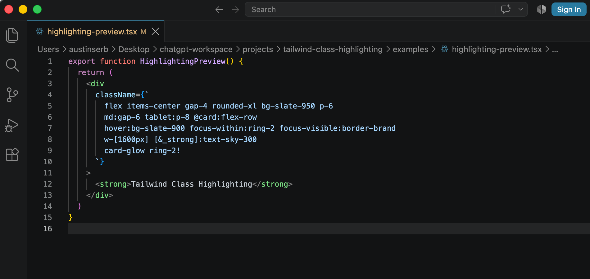
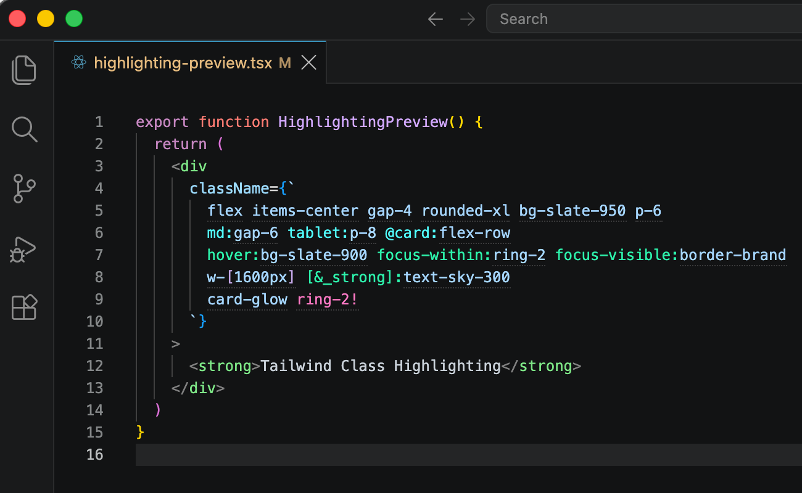

# Tailwind Class Highlighting

[](https://github.com/Serbyte-Development/tailwind-class-highlighting/actions/workflows/ci.yml)
[](LICENSE)

<!--
[](https://marketplace.visualstudio.com/items?itemName=serbytedevelopment.tailwind-class-highlighting)
[](https://marketplace.visualstudio.com/items?itemName=serbytedevelopment.tailwind-class-highlighting)
[](https://open-vsx.org/extension/serbytedevelopment/tailwind-class-highlighting)
-->

Make dense Tailwind CSS v4 class lists easier to read in VS Code, Cursor, and compatible editors.

### Before



### With Tailwind Class Highlighting



- **See responsive changes immediately.** Breakpoints and container-query variants stand out from normal utilities.
- **Separate behavior from layout.** `hover:`, `focus:`, `dark:`, `data-*`, `aria-*`, and other variants use their own color.
- **Spot arbitrary values quickly.** Only the square brackets in values such as `w-[317px]` are colored.
- **Make important classes obvious.** Classes using `!` get one foreground treatment across the whole candidate.
- **Keep normal utilities calm.** Recognized utilities keep the editor's normal text color and receive only a faint dotted underline.
- **Leave your own classes alone.** Custom non-Tailwind classes are not styled.
- **Follow your actual Tailwind project.** Tailwind v4 utilities, theme values, custom variants, custom breakpoints, and `@utility` definitions are validated by the project's own Tailwind installation.

**Requires Tailwind CSS v4.** Tailwind CSS v3 and earlier are intentionally unsupported.

**Developed & maintained by [Serbyte Development](https://www.serbyte.net/)** · [GitHub](https://github.com/Serbyte-Development)

## Why use it?

Tailwind puts a lot of information inside one string. Once a component has responsive styles, state variants, arbitrary values, container queries, and important modifiers, that string becomes much harder to scan than the JSX around it.

Tailwind Class Highlighting adds just enough visual structure to make those class lists readable without turning every utility into a rainbow.

## Highlighting

- Tailwind utilities get a faint dotted underline.
- Breakpoint variants such as `sm:`, `md:`, `max-lg:`, and container-query breakpoints use a distinct color.
- State and behavior variants such as `hover:`, `focus:`, `dark:`, `data-*`, and `aria-*` use a second color.
- Square brackets in arbitrary values and variants such as `w-[317px]` and `[&>svg]:size-4` use a subtle third color.
- Important classes using a leading or trailing `!` use one foreground color across the whole class.
- Custom classes are left completely unchanged.

Important styling takes foreground precedence over breakpoint, state, and arbitrary-bracket colors. Theme defaults are provided for light, dark, and high-contrast themes.

### Theme colors

All visual colors are native VS Code theme colors and can be overridden with `workbench.colorCustomizations`:

```json
{
  "workbench.colorCustomizations": {
    "tailwindClassHighlighting.utilityUnderline": "#8080805C",
    "tailwindClassHighlighting.breakpoint": "#51FFFF",
    "tailwindClassHighlighting.variant": "#2DF3AC",
    "tailwindClassHighlighting.arbitrary": "#C4A7E7",
    "tailwindClassHighlighting.important": "#FF7AC6"
  }
}
```

The extension is intentionally focused on readability. It does not provide completion, linting, formatting, or class sorting, and is designed to work alongside the official Tailwind CSS IntelliSense extension.

## Supported class contexts

- `class` and `className`
- Vue `:class` / `v-bind:class`
- Angular `ngClass`
- Astro `class:list`
- `clsx`, `classnames`, `cn`, `cva`, `twMerge`
- configurable class functions and tagged templates

Tailwind Class Highlighting also reads custom `tailwindCSS.classFunctions` and `tailwindCSS.classAttributes` settings when Tailwind CSS IntelliSense is installed.

## Tailwind support

Candidate extraction is powered by a bundled, lazy `@tailwindcss/oxide` scanner. Semantic Tailwind v4 validation comes from the workspace project's installed `tailwindcss` package and CSS design system.

This means project-defined Tailwind features such as `@utility`, `@custom-variant`, custom theme values, custom breakpoints, and custom container-query names work without waiting for this extension to add matching utility rules.

For Tailwind v4, `@import "tailwindcss"` is the project anchor. The extension finds those imports within the document's workspace/package boundary, follows relative CSS importers upward to the top-level root, and keeps multiple Tailwind entrypoints isolated. It never searches above the active VS Code workspace folder, and if two roots are equally plausible it leaves the document unchanged rather than guessing.

Tailwind CSS v3 and earlier are intentionally unsupported. If no local Tailwind v4 project can be resolved, or its design system cannot be loaded, the extension leaves the document unchanged rather than guessing which classes are Tailwind.

The bundled Oxide scanner remains intentional: installing `tailwindcss` alone does not guarantee that `@tailwindcss/oxide` exists in the project.

## Platforms

Oxide is a native dependency, so releases are packaged separately for:

- macOS x64 and arm64
- Windows x64 and arm64
- Linux x64 and arm64

## Settings

All settings are under `tailwindClassHighlighting`:

- `enabled` - enable or disable highlighting.
- `languages` - VS Code language IDs to scan.
- `classAttributes` - additional class-bearing attributes.
- `classFunctions` - regular-expression patterns for class helper functions or tagged templates.
- `debounceMs` - edit debounce from 0 to 250 ms.

## Performance

The extension scans only class-bearing source regions, performs one Oxide scan per update, caches project/design-system resolution, caches candidate validity inside each loaded design system, batches ranges by visual treatment, and skips decoration calls whose ranges did not change. Oxide and project-local Tailwind loading happen only when a supported editor actually needs highlighting.

The synthetic dense-file benchmark can be run with:

```sh
npm run bench
```

## Development

```sh
npm install
npm test
npm run check
npm run format:check
npm run build
npm run bench
npm run package
```

`npm run package` creates a VSIX for the current operating system and CPU architecture. The Package GitHub Actions workflow builds all six supported release targets.

## Support

For bugs, compatibility issues, or feature requests, open an issue in the GitHub repository. See `SUPPORT.md` for support scope.

## License

MIT. Tailwind CSS Oxide is also MIT licensed; see `THIRD_PARTY_NOTICES.md`.
